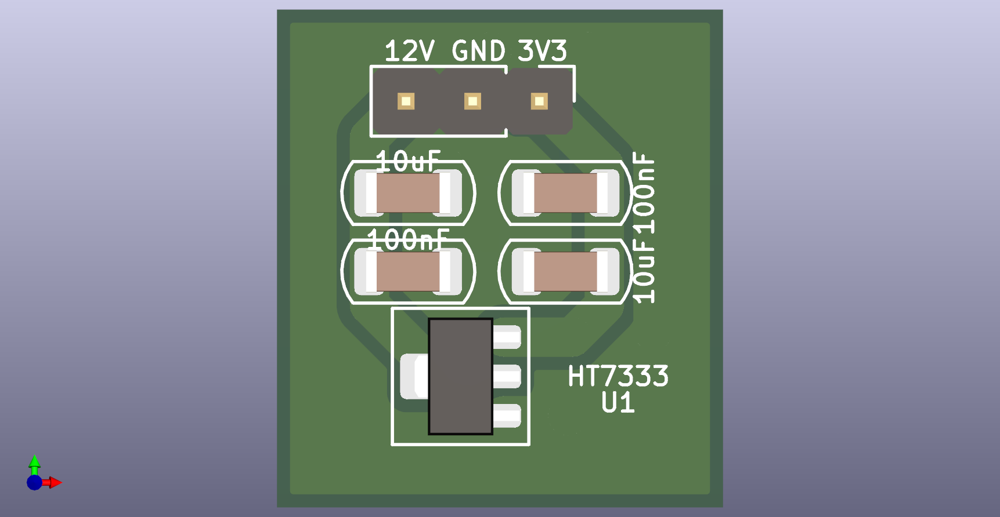
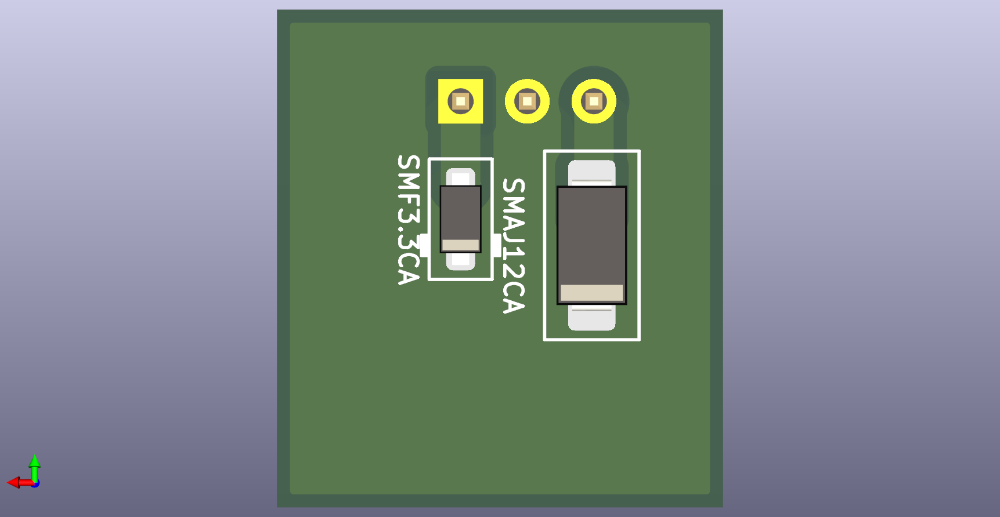

# HT7333

  
  
  

[HT7333](https://item.szlcsc.com/323851.html?fromZone=s_s__%2522HT7333%2522&spm=sc.gb.xh2.zy.n___sc.hm.hd.ss&lcsc_vid=EwQKBQVXRFYIBQVTR1JbVFcAFgRYUl0AFFNZVAEARVQxVlNSQVZWVVFfRVBZXzsOAxUeFF5JWBYZEEoEHg8JSQcJGk4%3D)

LDO

VIN 12V
VOUT 3.3V
IOUT 250mA
package SOT-89-3
IQ 3uA
VD 90mV@40mA

引脚定义

1 GND
2 VIN
3 VOUT

所以使用kciad 里面的 Regulator_Generic_GND_IN_OUT 生成符号

封装采用PCM_Package_TO_SOT_SMD_AKL:SOT-89-3, 已确认封装焊盘顺序定义无误
